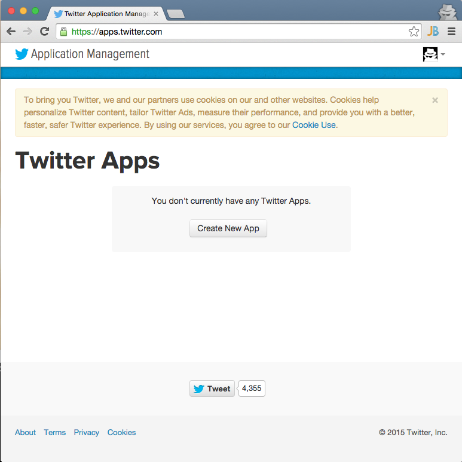
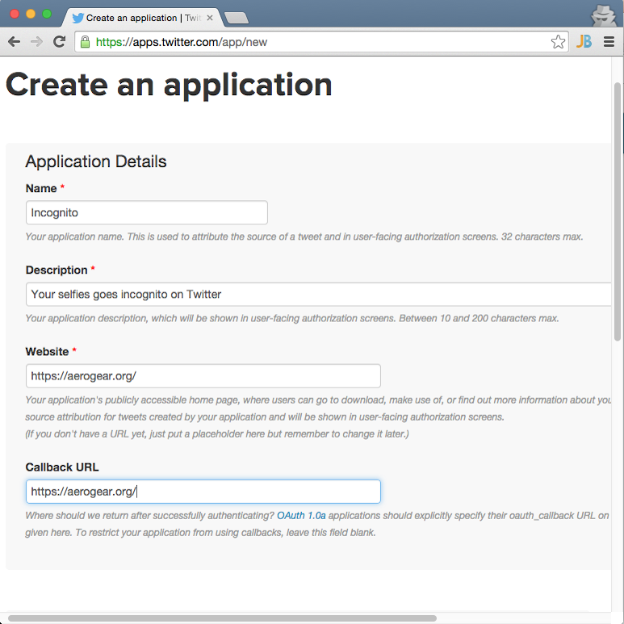
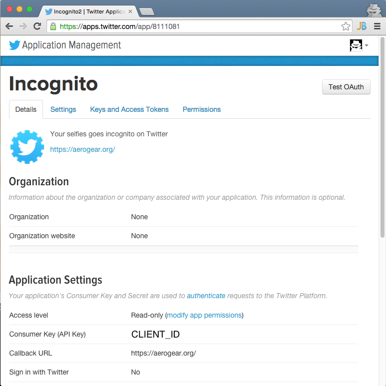
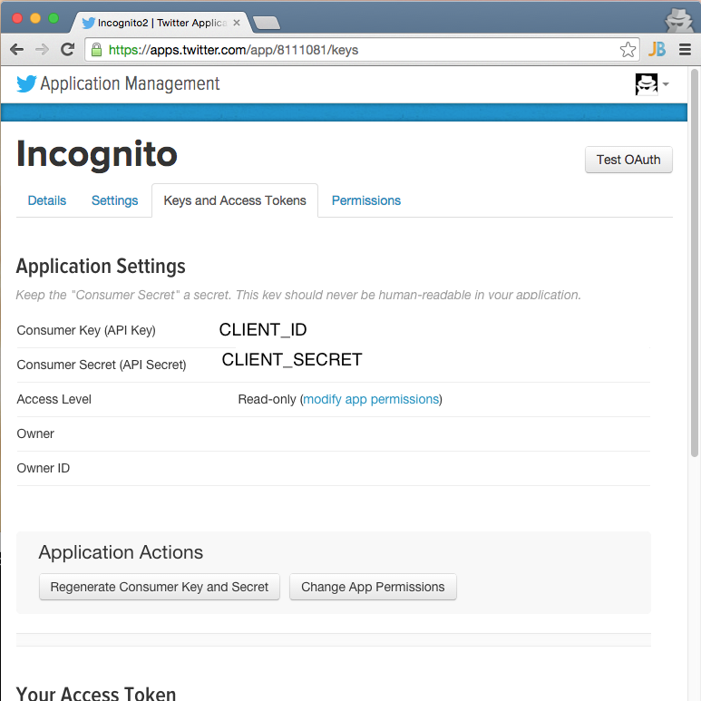

Incognito
=========
Make your selfies go incognito on Twitter :)

## Run it in Xcode

The project uses [cocoapods](http://cocoapods.org) 0.36 release for handling its dependencies. As a pre-requisite, install [cocoapods](http://blog.cocoapods.org/CocoaPods-0.36/) and then install the pod. On the root directory of the project run:

```bash
pod install
```
and then double click on the generated .xcworkspace to open in Xcode.

## Configuration

### Twitter app setup

First, you must authenticate with Twitter. You will need a Twitter Account for this. You account should have a mobile app phone number set-up under the "Profile > Mobile" menu. Now open the [Twitter apps Console](https://apps.twitter.com).



If you haven’t created a project before you dashboard will be empty like below. Click "Create New App", fill in the form, for the website and callback url use any URL. 



NOTE: Twitter does not check Callback URL server side.

Accept terms and conditions and click "Create your Twitter application".

Once created you have your app details:



Go to "Keys and Access tokens" to get your ```CLIENT_ID``` and ```CLIENT_SECRET```.



### Set client_id and client_secret
In ```Incognito/ViewController.swift``` paste your ```CLIENT_ID``` and ```CLIENT_SECRET```:

```swift
    @IBAction func share(sender: AnyObject) {
       
        let config = OAuth1Config(accountId: "Twitter",
            base: "https://api.twitter.com/oauth/",
            requestTokenEndpoint: "request_token",
            authorizeEndpoint: "authorize",
            accessTokenEndpoint: "access_token",
            redirectURL: "org.aerogear.Incognito://oauth-callback/twitter",
            clientId: "YOUR_CLIENT_ID",
            clientSecret: "YOUR_CLIENT_SECRET")
        let oauth1 = OAuth1Module(config: config)
        ....
    }
```
## UI Flow
When you start the application select a selfie from your camera roll. Put on glasses and mustache and share to tweet it.


